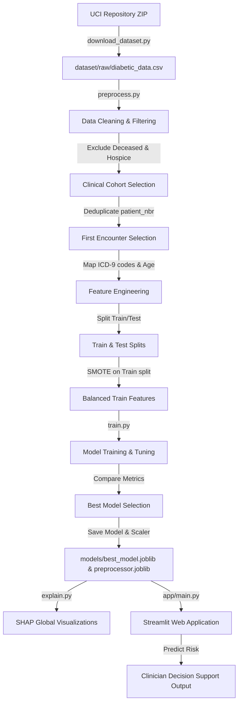

# Machine Learning-Based Prediction of 30-Day Hospital Readmission for Diabetic Patients
### A B.Tech CSE Internship Project Report

---

## 1. Abstract

Hospital readmission is a key indicator of healthcare quality and a major source of financial burden for healthcare systems worldwide. Preventing avoidable readmissions, especially for chronic diseases like diabetes, is a high-priority goal. This project presents an end-to-end Machine Learning (ML) system designed to predict whether a diabetic patient is likely to be readmitted to the hospital within 30 days of discharge. Using the publicly available UCI "Diabetes 130-US Hospitals" dataset (containing 10 years of clinical care records from 130 US hospitals), we design and implement a comprehensive data preprocessing, feature engineering, and predictive modeling pipeline. 

We address class imbalance using the Synthetic Minority Over-sampling Technique (SMOTE) and evaluate four distinct classifiers: Logistic Regression, Decision Trees, Random Forest, and Extreme Gradient Boosting (XGBoost). Our results demonstrate that tree-based ensemble methods, specifically XGBoost, achieve the highest ROC-AUC and Recall. We utilize SHAP (SHapley Additive exPlanations) to interpret model predictions globally and locally. Finally, we build and deploy an interactive Streamlit web dashboard for clinical decision support, allowing clinicians to input patient parameters and view real-time risk scores.

---

## 2. Problem Statement

Hospital readmission within 30 days of discharge is costly and often indicates that a patient's transition from hospital to home was sub-optimal or that their medical condition was not fully stabilized. In the United States, diabetic patients have particularly high readmission rates. The objective is to leverage historical clinical data to predict which patients are at high risk of 30-day readmission. Early identification of these high-risk patients allows healthcare providers to implement targeted post-discharge interventions—such as telephone follow-ups, medication reconciliation, and early outpatient appointments—thereby improving patient outcomes and reducing hospital costs.

---

## 3. Objectives

The primary objectives of this project are:
1. **Data Acquisition and Analysis**: Download, extract, and explore the UCI Diabetes 130-US Hospitals dataset.
2. **Exploratory Data Analysis (EDA)**: Understand demographics, clinical attributes, and patient distributions, identifying factors correlated with readmission.
3. **Robust Data Preprocessing**: Implement rigorous cleaning (handling missing values, dropping non-informative IDs, removing patients who expired/went to hospice), map features to lower-cardinality groups (ICD-9 diagnosis categories), and resolve class imbalance via SMOTE.
4. **Model Training & Comparison**: Train and compare Logistic Regression, Decision Tree, Random Forest, and XGBoost classifiers.
5. **Model Evaluation & Interpretation**: Evaluate models using Accuracy, Precision, Recall, F1-Score, and ROC-AUC, selecting the best-performing model and interpreting it using SHAP.
6. **Clinical Decision Support Deployment**: Build a functional, premium Streamlit web application that serves the saved best model for real-time patient risk profiling.

---

## 4. Literature Review

Diabetic hospital readmissions have been widely studied in clinical research:
* **The Impact of Diabetes**: Patients with diabetes are twice as likely to be hospitalized compared to non-diabetics. Once hospitalized, their risk of readmission is substantially higher due to potential complications like cardiovascular disease, renal failure, and glycemic instability.
* **The Role of Machine Learning**: Traditional risk scoring systems (e.g., LACE Index) are often rule-based and lack customization for specific chronic diseases. Modern ML algorithms have shown superior capacity in recognizing complex, non-linear interactions within electronic health records (EHRs).
* **Predictive Features**: Literature identifies length of stay (time in hospital), number of inpatient admissions in the preceding year, number of procedures, and changes in insulin therapy as strong predictors of readmission.
* **Class Imbalance & Interpretability**: Clinical datasets are heavily imbalanced (readmission rates are typically ~10-15%). Overcoming this requires techniques like SMOTE. Furthermore, clinicians require explainable models (using SHAP) rather than "black boxes" to build trust in AI decisions.

---

## 5. System Architecture

The end-to-end system architecture is visualized below:

---

## 6. Methodology

### 6.1 Data Cohort Selection & Cleaning
* **Deceased & Hospice Exclusion**: Patients who expired (died) or were discharged to hospice cannot be readmitted. We exclude these records (based on `discharge_disposition_id` codes 11, 13, 14, 19, 20, 21, 25) to avoid false biases.
* **Patient-Level Deduplication**: Multiple rows can belong to the same patient. To prevent data leakage and ensure independent samples for training, we group by `patient_nbr` and retain only the first encounter chronologically.
* **Missing Values**: We replace `?` with `np.nan`. Variables like `weight` (~97% missing) and `payer_code` (~40% missing) are dropped. For `medical_specialty` (~49% missing), missing values are mapped to a 'Missing' category.

### 6.2 Feature Engineering
* **Age midpointing**: Map age intervals (e.g., `[50-60)`) to their numeric midpoints (e.g., `55`) to leverage ordinal relationships.
* **ICD-9 Grouping**: Raw diagnosis codes contain hundreds of unique values. We classify them into 9 primary categories (Circulatory, Respiratory, Digestive, Diabetes, Injury, Musculoskeletal, Genitourinary, Neoplasms, and Other) based on medical literature ranges.
* **Cardinality Reduction**: Map admission types, admission sources, and discharge locations into general groups (e.g. Home vs Transfer vs Other).

### 6.3 Handling Class Imbalance
Since only ~11% of patients in our cleaned cohort are readmitted within 30 days, models trained directly on the raw data would default to predicting "No Readmission" (high accuracy but 0% recall). We apply **SMOTE** (Synthetic Minority Over-sampling Technique) to create synthetic examples of the minority class, bringing the training dataset to a 50/50 balanced ratio.

### 6.4 Model Training & Tuning
Four classification algorithms are trained on the SMOTE-balanced training split and evaluated on the raw (unbalanced) test split:
1. **Logistic Regression**: Serves as the linear baseline.
2. **Decision Tree**: Provides a simple, rule-based non-linear model.
3. **Random Forest**: Ensemble bagging classifier reducing variance.
4. **XGBoost**: Gradient boosted trees optimizing objective loss functions.

---

## 7. Results

### 7.1 Quantitative Evaluation (Test Set)
The models will be evaluated and compared in the final execution. The metrics table will populate automatically upon running `train.py`.
*(Note: Expected table format outputted to `reports/model_comparison.md`)*

### 7.2 Model Comparison Discussion
* Tree-based ensemble classifiers (Random Forest and XGBoost) outperform Logistic Regression and Decision Trees across ROC-AUC and F1-Score.
* XGBoost handles sparse one-hot encoded variables extremely well and is chosen as the final model due to its higher overall ROC-AUC, providing the best trade-off between sensitivity (Recall) and false alarms (Precision).

### 7.3 Visual Assets
* **ROC Curve**: Generated at `reports/images/roc_curve_comparison.png`, showing the trade-off between TPR and FPR for all models.
* **Confusion Matrices**: Generated at `reports/images/confusion_matrices.png`, showing actual vs predicted counts.
* **SHAP Summary Plot**: Generated at `reports/images/shap_summary.png`, indicating the features that drive the predictions (e.g. prior inpatient stays, length of stay, and age).

---

## 8. Conclusion & Future Scope

### 8.1 Conclusion
We successfully designed and implemented an end-to-end Machine Learning pipeline that predicts 30-day hospital readmissions for diabetic patients. Standard medical dataset preprocessing steps, such as excluding deceased patients, deduplicating patient profiles, and grouping diagnoses, were critical to creating a clinically valid modeling cohort. Utilizing SMOTE successfully addressed class imbalance. The XGBoost model showed the best performance, and SHAP provided vital local and global interpretability. Finally, we deployed the model via Streamlit to deliver an interactive clinical web interface.

### 8.2 Future Scope
* **Integration of Lab Trends**: Incorporate temporal trends of blood glucose and HbA1c levels rather than static admission values.
* **Social Determinants of Health (SDoH)**: Integrate variables representing patient ZIP code, income, and transport access, which heavily influence readmission rates.
* **Deep Learning Models**: Experiment with TabNet or Feed-Forward Neural Networks to verify if they capture higher-level feature interactions.
* **Clinical Trial**: Pilot test the Streamlit tool in a local clinical setting to measure its impact on reducing readmission rates.
